# Vue + Mui + golang实现简易即时通讯系统

- 本项目基于慕课网课程稍作修改，修复其中一些bug

演示视频地址：<https://www.bilibili.com/video/BV1Vk4y1674c>

## 技术栈：

> 后端：golang+xorm
>
> 前端：vue+mui

- IM一般系统架构

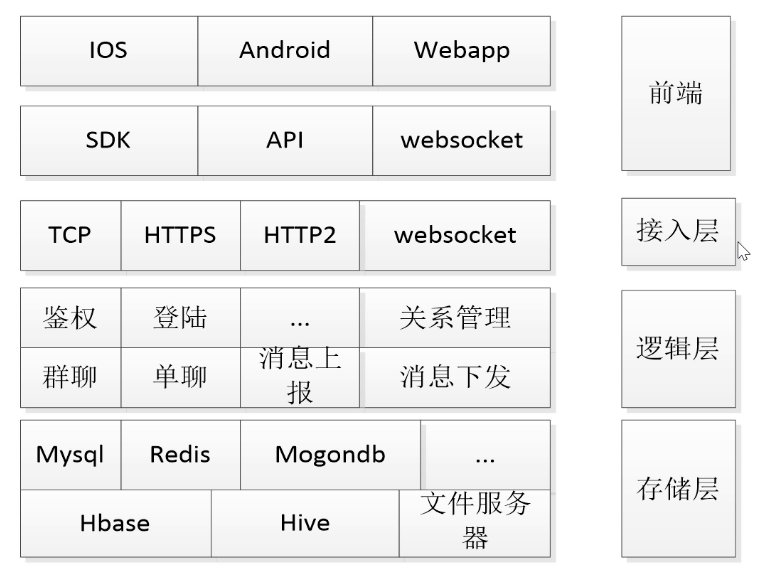

- 已实现和重点

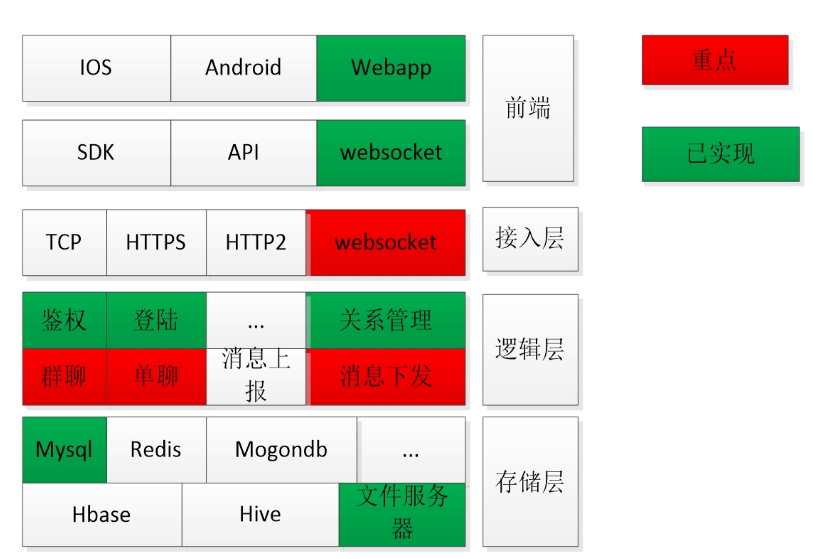

- 网络结构

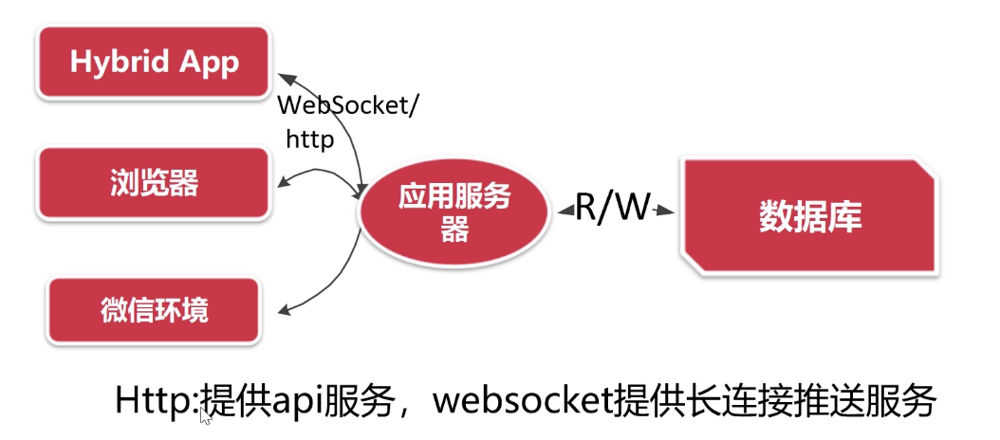

## 重点难点

### 1. Websocket

> 技术选型：
>
> - "github.com/gorilla/websocket"

### 2. 用户接入和鉴权

- 用户ID和token

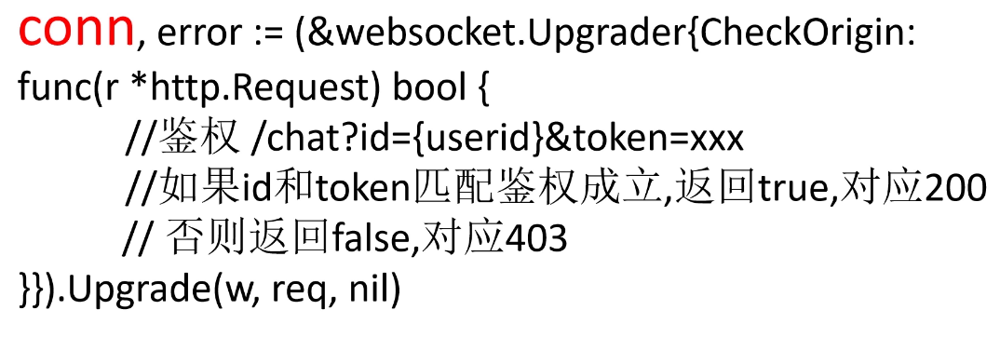

### 3. Conn的维护

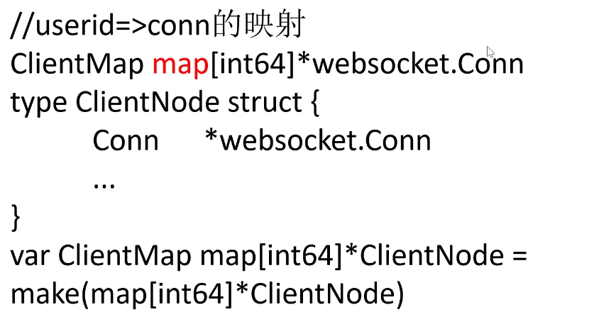

### 4. 消息体的发送

```go
type Message struct {
	Id      int64  `json:"id,omitempty" form:"id"`           //消息ID
	Userid  int64  `json:"userid,omitempty" form:"userid"`   //谁发的
	Cmd     int    `json:"cmd,omitempty" form:"cmd"`         //群聊还是私聊
	Dstid   int64  `json:"dstid,omitempty" form:"dstid"`     //对端用户ID/群ID
	Media   int    `json:"media,omitempty" form:"media"`     //消息按照什么样式展示
	Content string `json:"content,omitempty" form:"content"` //消息的内容
	Pic     string `json:"pic,omitempty" form:"pic"`         //预览图片
	Url     string `json:"url,omitempty" form:"url"`         //服务的URL
	Memo    string `json:"memo,omitempty" form:"memo"`       //简单描述
	Amount  int    `json:"amount,omitempty" form:"amount"`   //其他和数字相关的
}
```

- 消息发送与接收

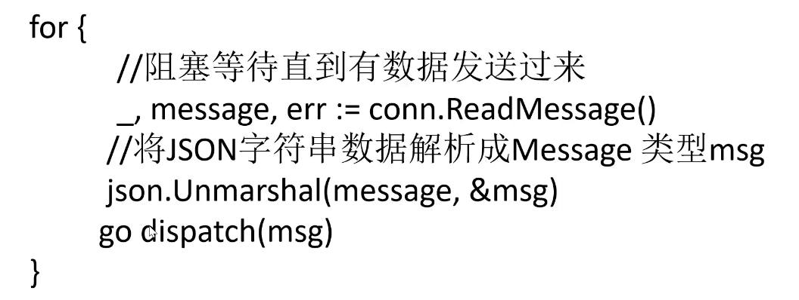


- 发送消息流程

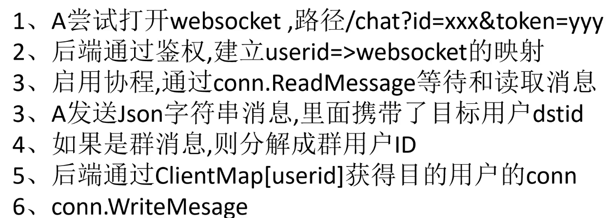

### 5. 性能优化

#### 5.1 设计高质量代码优化Map

- 使用读写锁
- map不要太大

#### 5.2 突破系统瓶颈优化连接数

- Linux系统还是windows系统
- 优化最大文件数

#### 5.3 降低对Cpu资源的使用

- 降低Json编码频次
- 一次编码多次使用

#### 5.4 降低对IO资源的使用 

- 合并写数据库次数
- 优化对数据库读操作
- 能缓存的就缓存

#### 5.5 应用/资源服务分离

- 系统提供动态服务
- 文件服务迁移到oss

## 关键技术点：

### 1. 如何安全接入聊天界面？

> 登录之后获取id和token,将token返回前端，每次请求需token验证
>
> - token生成采用当前时间md5加密的方式
> - 密码加密采用用户明文密码加盐（盐为随机六位整数）MD5加密的方式

### 2. 如何添加/显示好友 添加/显示群

```go
/contact/addfriend 自动添加好友,参数userid,dstid
用户10000添加好友10086,往contact表中添加俩条记录
一条ownerid =10000,dstobj=10086 
一条ownerid =10086,dstobj=10000

/contact/loadfriend 显示全部好友,参数userid
/contact/createcommunity 建群,头像pic,名称name,备注memo,创建者userid
/contact/loadcommunity 显示全部群 参数userid
/contact/joincommunity 加群,参数userid,dstid

// 创建模型
type Contact struct {
	Id int64 `xorm:"pk autoincr bigint(20)" form:"id" json:"id"`
	Ownerid int64 `xorm:"bigint(20)" form:"ownerid" json:"ownerid"` // 记录是谁的
	Dstid int64 `xorm:"bigint(20)" form:"dstid" json:"dstid"` // 对端信息
	Cate int    `xorm:"int(11)" form:"cate" json:"cate"`      // 什么类型
	Memo string `xorm:"varchar(120)" form:"memo" json:"memo"` // 备注
	Createat time.Time `xorm:"datetime" form:"createat" json:"createat"` // 创建时间
}
```
### 3. 设计可以无限扩张业务场景的消息通讯结构

```cgo
func recvproc(node *Node) {
	for{
		_,data,err := node.Conn.ReadMessage()
		if err!=nil{
			log.Println(err.Error())
			return
		}
		//todo 对data进一步处理
		//dispatch(data)
		fmt.Printf("recv<=%s",data)
	}
}
```
- 原理

前端通过websocket发送`json格式的字符串`
用户2向用户3发送文字消息hello
```json5
{id:1,userid:2,dstid:3,cmd:10,media:1,content:"hello"}
里面携带
谁发的-userid
要发给谁-dstid
这个消息有什么用-cmd
消息怎么展示-media
消息内容是什么-(url,amout,pic,content等)
```
- 核心数据结构

```go
type Message struct {
	Id      int64  `json:"id,omitempty" form:"id"` //消息ID
	//谁发的
	Userid  int64  `json:"userid,omitempty" form:"userid"` //谁发的
	//什么业务
	Cmd     int    `json:"cmd,omitempty" form:"cmd"` //群聊还是私聊
	//发给谁
	Dstid   int64  `json:"dstid,omitempty" form:"dstid"`//对端用户ID/群ID
	//怎么展示
	Media   int    `json:"media,omitempty" form:"media"` //消息按照什么样式展示
	//内容是什么
	Content string `json:"content,omitempty" form:"content"` //消息的内容
	//图片是什么
	Pic     string `json:"pic,omitempty" form:"pic"` //预览图片
	//连接是什么
	Url     string `json:"url,omitempty" form:"url"` //服务的URL
	//简单描述
	Memo    string `json:"memo,omitempty" form:"memo"` //简单描述
	//其他的附加数据，语音长度/红包金额
	Amount  int    `json:"amount,omitempty" form:"amount"` //其他和数字相关的
}
const (
    //点对点单聊,dstid是用户ID
	CMD_SINGLE_MSG = 10
	//群聊消息,dstid是群id
	CMD_ROOM_MSG   = 11
	//心跳消息,不处理
	CMD_HEART      = 0
	
)
const (
    //文本样式
	MEDIA_TYPE_TEXT=1
	//新闻样式,类比图文消息
	MEDIA_TYPE_News=2
	//语音样式
	MEDIA_TYPE_VOICE=3
	//图片样式
	MEDIA_TYPE_IMG=4
	
	//红包样式
	MEDIA_TYPE_REDPACKAGR=5
	//emoj表情样式
	MEDIA_TYPE_EMOJ=6
	//超链接样式
	MEDIA_TYPE_LINK=7
	//视频样式
	MEDIA_TYPE_VIDEO=8
	//名片样式
	MEDIA_TYPE_CONCAT=9
	//其他自己定义,前端做相应解析即可
	MEDIA_TYPE_UDEF=100
)
/**
消息发送结构体,点对点单聊为例
1、MEDIA_TYPE_TEXT
{id:1,userid:2,dstid:3,cmd:10,media:1,
content:"hello"}

3、MEDIA_TYPE_VOICE,amount单位秒
{id:1,userid:2,dstid:3,cmd:10,media:3,
url:"http://www.a,com/dsturl.mp3",
amount:40}

4、MEDIA_TYPE_IMG
{id:1,userid:2,dstid:3,cmd:10,media:4,
url:"http://www.baidu.com/a/log.jpg"}


2、MEDIA_TYPE_News
{id:1,userid:2,dstid:3,cmd:10,media:2,
content:"标题",
pic:"http://www.baidu.com/a/log,jpg",
url:"http://www.a,com/dsturl",
"memo":"这是描述"}


5、MEDIA_TYPE_REDPACKAGR //红包amount 单位分
{id:1,userid:2,dstid:3,cmd:10,media:5,url:"http://www.baidu.com/a/b/c/redpackageaddress?id=100000","amount":300,"memo":"恭喜发财"}
6、MEDIA_TYPE_EMOJ 6
{id:1,userid:2,dstid:3,cmd:10,media:6,"content":"cry"}

7、MEDIA_TYPE_Link 7
{id:1,userid:2,dstid:3,cmd:10,media:7,
"url":"http://www.a.com/dsturl.html"
}

8、MEDIA_TYPE_VIDEO 8
{id:1,userid:2,dstid:3,cmd:10,media:8,
pic:"http://www.baidu.com/a/log,jpg",
url:"http://www.a,com/a.mp4"
}

9、MEDIA_TYPE_CONTACT 9
{id:1,userid:2,dstid:3,cmd:10,media:9,
"content":"10086",
"pic":"http://www.baidu.com/a/avatar,jpg",
"memo":"胡大力"}
*/
```

### 4. 从哪里接收数据?怎么处理这些数据呢?

```go
func recvproc(node *Node) {
	for{
		_,data,err := node.Conn.ReadMessage()
		if err!=nil{
			log.Println(err.Error())
			return
		}
		//todo 对data进一步处理
		fmt.Printf("recv<=%s",data)
		dispatch(data)
	}
}
func dispatch(data []byte){
    //todo 转成message对象
    //todo 根据cmd参数处理逻辑
    msg :=Message{}
    err := json.UnMarshal(data,&msg)
    if err!=nil{
        log.Printf(err.Error())
        return ;
    }
    switch msg.Cmd {
    	case CMD_SINGLE_MSG: //如果是单对单消息,直接将消息转发出去
    		//向某个用户发回去
    		fmt.Printf("c2cmsg %d=>%d\n%s\n",msg.Userid,msg.Dstid,string(tmp))
    		SendMsgToUser(msg.Userid, msg.Dstid, tmp)
    		//fmt.Println(msg)
    	case CMD_ROOM_MSG: //群聊消息,需要知道
    		fmt.Printf("c2gmsg %d=>%d\n%s\n",msg.Userid,msg.Dstid,string(tmp))
    		SendMsgToRoom(msg.Userid, msg.Dstid, tmp)
    	case CMD_HEART:
    	default:
    	    //啥也别做
    	    
    	}
    		
}
```
### 5. 实现发送文字

```go
前端user1拼接好数据对象Message
msg={id:1,userid:2,dstid:3,cmd:10,media:1,content:txt}
转化成json字符串jsonstr
jsonstr = JSON.stringify(msg)
通过websocket.send(jsonstr)发送
后端S在recvproc中接收收数据data
并做相应的逻辑处理dispatch(data)-转发给user2
user2通过websocket.onmessage收到消息后做解析并显示
```

###6. 表情包简单逻辑
弹出一个窗口,
选择图片获得一个连接地址
调用sendpicmsg方法开始发送流程

### 7. 发送图片/拍照

弹出一个窗口,
选择图片,上传到服务器
获得一个链接地址
调用sendpicmsg方法开始发送流程

优化：上传到阿里oss

###8. 发送语音
弹出一个窗口,
选择按钮,进行录音操作,获得录音文件
上传到服务器,
获得一个连接地址
调用
sendaudiomsg方法 开始发送流程
###9.  发送视频（还未开放）
弹出一个窗口,
选择按钮,选择视频
上传到服务器,
获得一个连接地址
调用
sendaudiomsg方法 开始发送流程

###10. 实现群聊

-  原理

分析群id,找到加了这个群的用户,把消息发送过去

- 方案一、

map<userid><qunid1,qunid2,qunid3>
优势是锁的频次低
劣势是要轮训全部map

```go
type Node struct {
	Conn *websocket.Conn
	//并行转串行,
	DataQueue chan []byte
	GroupSets set.Interface
}
//映射关系表
var clientMap map[int64]*Node = make(map[int64]*Node,0)
```
- 方案二、

map<群id><userid1,userid2,userid3>
优势是找用户ID非常快
劣势是发送信息时需要根据userid获取node,锁的频次太高

```go
type Node struct {
	Conn *websocket.Conn
	//并行转串行,
	DataQueue chan []byte
}
//映射关系表
var clientMap map[int64]*Node = make(map[int64]*Node,0)
var comMap map[int64]set.Interface= make(map[int64]set.Interface,0
```

- 需要处理的问题

  1、当用户接入的时候初始化groupset
  2、当用户加入群的时候刷新groupset
  3、完成信息分发

##  性能优化

> 1 锁的频次
>
> 2 json编码次数
>
> 3 静态资源分离

####1. 支持分布式
回顾单体应用
开启ws接收协程recvproc/ws发送协程sendproc
websocket收到消息->dispatch发送给dstid

基于UDP的分布式应用
开启ws接收协程recvproc/ws发送协程sendproc
开启udp接收协程udprecvproc/udp发送协程udpsendproc

websocket收到消息->broadMsg广播到局域网
udp接收到收到消息->dispatch发送给dstid
自己是局域网一份子,所以也能接收到消息

####2 实现

- nginx反向代理

```html
	upstream wsbackend {
			server 192.168.0.102:8080;
			server 192.168.0.100:8080;
			hash $request_uri;
	}
	map $http_upgrade $connection_upgrade {
    default upgrade;
    ''      close;
	}
    server {
	  listen  80;
	  server_name localhost;
	  location / {
	   proxy_pass http://wsbackend;
	  }
	  location ^~ /chat {
	   proxy_pass http://wsbackend;
	   proxy_connect_timeout 500s;
       proxy_read_timeout 500s;
	   proxy_send_timeout 500s;
	   proxy_set_header Upgrade $http_upgrade;
       proxy_set_header Connection "Upgrade";
	  }
	 }

}
```
####3, 打包发布
- windows平台

```bash
::remove dir
rd /s/q release
::make dir 
md release
::go build -ldflags "-H windowsgui" -o chat.exe
go build -o chat.exe
::
COPY chat.exe release\
COPY favicon.ico release\favicon.ico
::
XCOPY asset\*.* release\asset\  /s /e
XCOPY view\*.* release\view\  /s /e 
```
- linux平台

```bash
#!/bin/sh
rm -rf ./release
mkdir  release
go build -o chat
chmod +x ./chat
cp chat ./release/
cp favicon.ico ./release/
cp -arf ./asset ./release/
cp -arf ./view ./release/
```
- 运行注意事项
- linux 下

```bash
nohup ./chat >>./log.log 2>&1 &
```
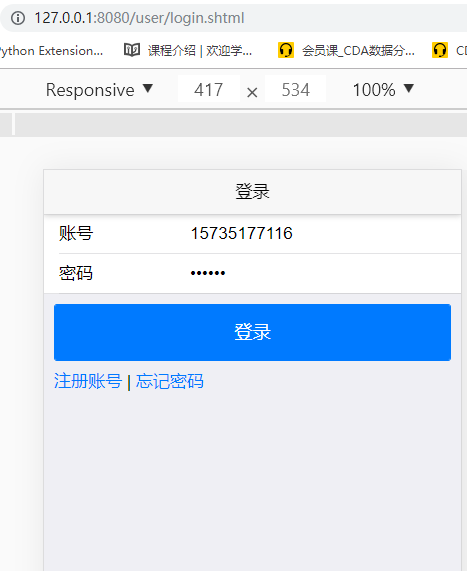

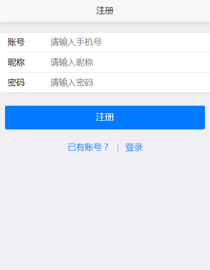

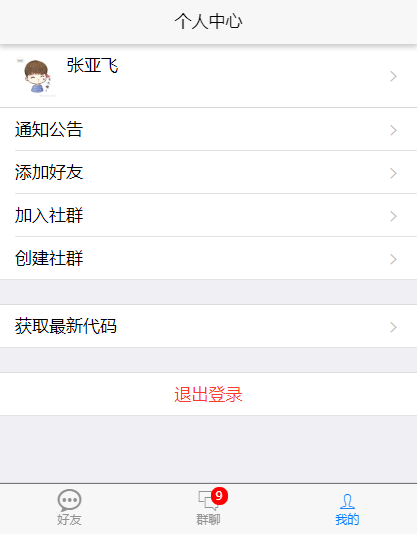

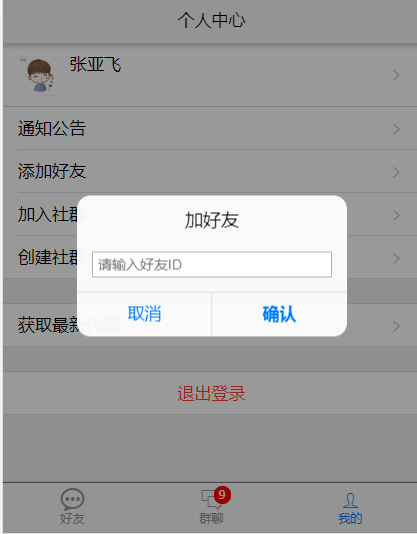

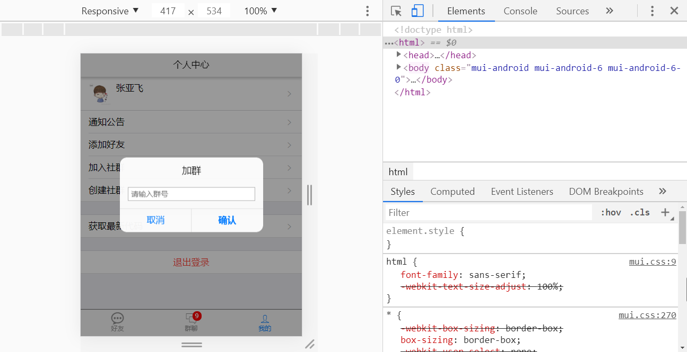

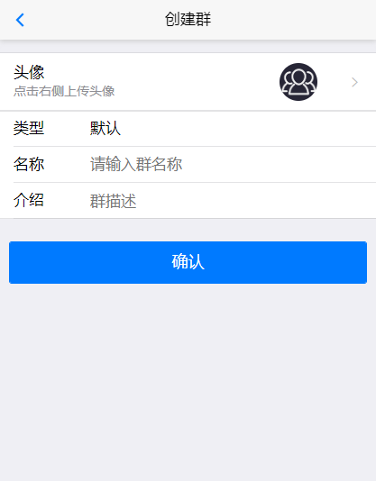

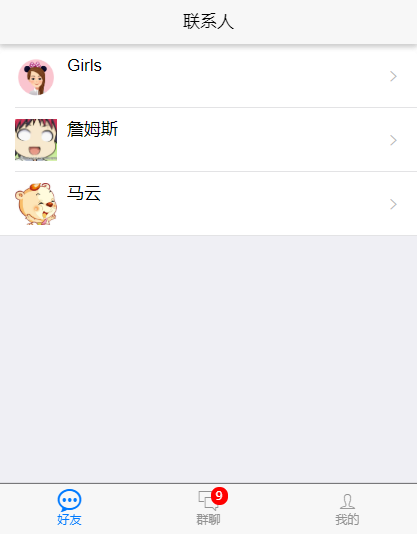

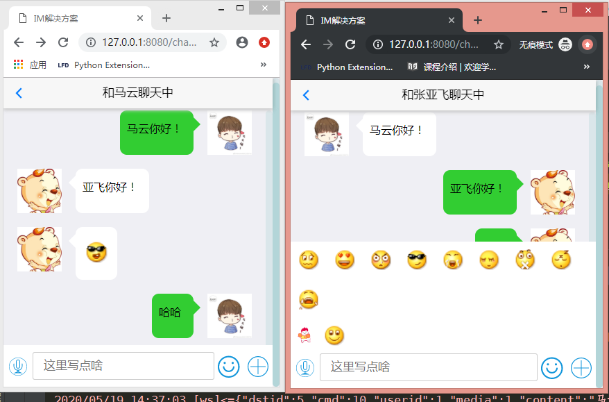

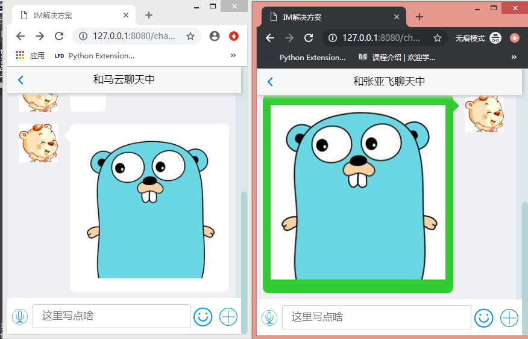

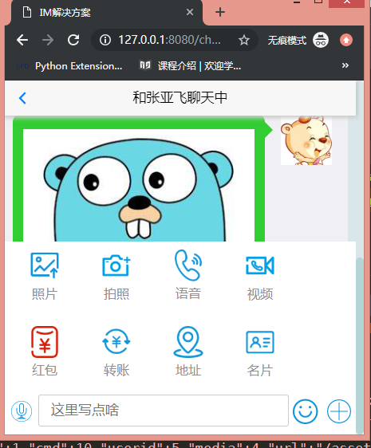

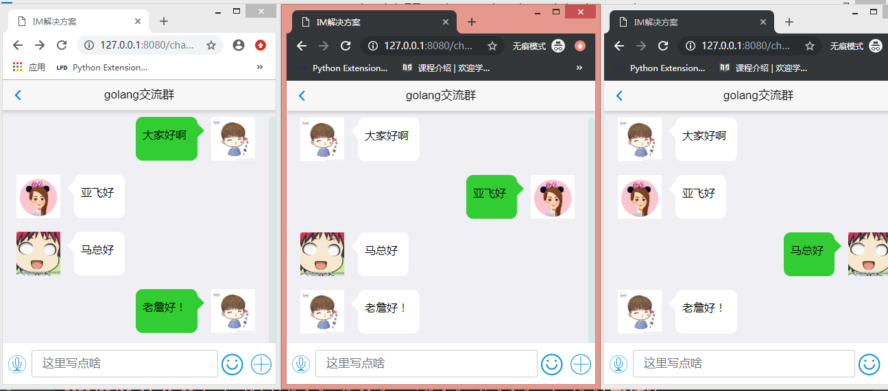

